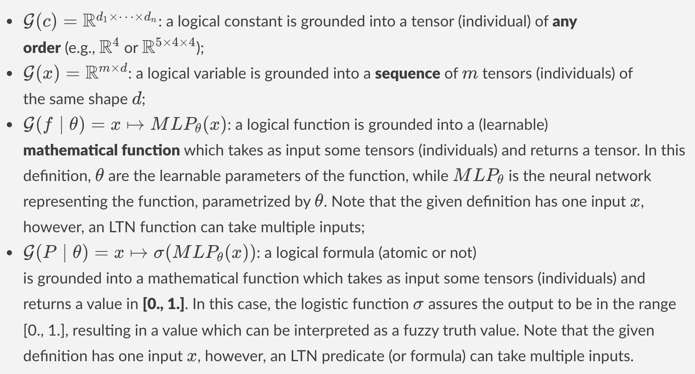
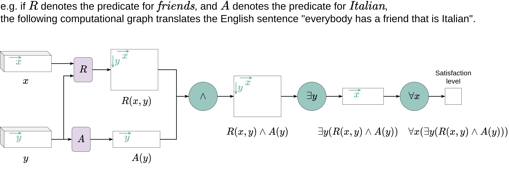
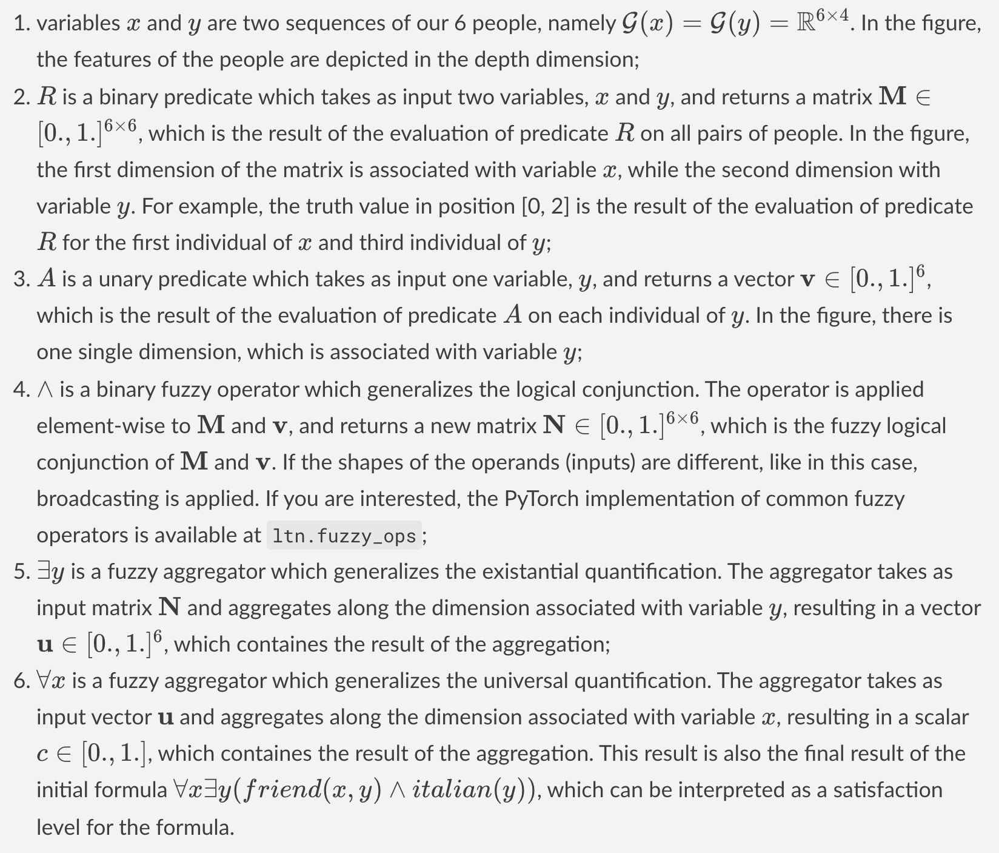

# PyTorch's implementation of Logic Tensor Networks (LTN)

Welcome to the PyTorch's implementation of [Logic Tensor Networks](https://arxiv.org/abs/2012.13635)!

### Basic idea of the framework

Logic Tensor Network (LTN) is a Neural-Symbolic (NeSy) framework which supports learning of neural networks using the
satisfaction of a first-order logic knowledge base as an objective. In other words, LTN uses logical reasoning on the
knowledge base to guide the learning of a potentially deep neural network. 

The idea of the framework is simple: 
- we have a first-order logic knowledge base containing a set of axioms;
- we have some predicates, functions, or logical constants appearing in these axioms that we want to learn;
- we have some data available that we can use to learn the parameters of those symbols.

The idea is to use the logical axioms as a loss function for our Logic Tensor Network. The objective is to find solutions
in the hypothesis space that maximally satisfy all the axioms contained in our knowledge base.

### Learning in LTN

In LTN, the learnable parameters are contained in the predicates, functions, and possibly learnable logical constants
that appear in the logical axioms of the knowledge base. 

During the forward step of the back-propagation algorithm, LTN
computes the truth values of the logical formulas contained in the knowledge base, using the available data to ground
(or instantiate) the logical formulas. As we have already said, these formulas 
will contain some predicates and functions which are represented as learnable models. 

At the end of the forward phase,
the truth values computed for the formulas are aggregated and used in the loss function. Our objective is to maximize
the aggregated truth value, namely maximally satisfy all the axioms.

During the backward step, the
learnable parameters of predicates, functions, and possibly learnable logical constants are changed in such a way to move
towards a solution in the hypothesis space which better satisfies all the axioms in the knowledge base.

At the end of the training, the parameters of predicates, functions, and constants will have been updated in such a way the 
logical formulas in the knowledge base are maximally satisfied. In particular, the parameters will have been learned by using both
data (to ground the formulas) and logical reasoning (at the loss function).

After learning, it is possible to query predicates and functions on new data which was not available during training. Also,
it is possible to query the truth values of new formulas which were not included in the knowledge base during training. In addition,
if some logical constants have been learned, their parameters can be interpreted as embeddings.

### Real Logic logical language

To make this learning possible, LTN uses a differentiable first-order logic language, called Real Logic, which enables 
the incorporation of data and logic.

Real Logic defines the concept of `grounding` (different from the grounding of logic), which is a mapping from the logical domain (i.e., constants, variables, and logical symbols)
to tensors in the Real field or operations based on tensors. These operations could be, for instance, mathematical functions or learnable neural networks. In other words,
a `grounding`, denoted as 𝒢, is a function which maps a logical symbol into a real tensor or an operation on tensors.

In particular, the grounding is defined as follows. Let us assume that *c* is a constant, *x* is a logical 
variable, *P* is a predicate, and *f* is a logical function:

The `grounding` defines also how the logical connectives (∧, ∨, ¬, ⇒, ↔) and quantifiers
(∀, ∃) are mapped in the Real domain. In particular, logical connectives are grounded using fuzzy logic semantics, while
quantifiers are grounded using fuzzy aggregators. Please, **carefully** read the paper if you have some doubts on these notions.

Examples of possible groundings are showed in the following figure. In the figure, `friend(Mary, John)` is an
atomic formula (predicate), while `∀x(friend(John, x) ⇒ friend(Mary, x))` is a closed formula (all the variables are
quantified). The letter 𝒢, again, is the grounding, the function which maps the logical domain into the Real domain.

### LTN as PyTorch computational graphs

In practice, LTN converts Real Logic formulas (e.g., `∀x∃y(friend(x,y) ∧ italian(y))`, which states that everybody has a friend that is Italian) into [PyTorch](https://www.pytorch.org/) 
computational graphs. Such formulas can express complex queries about the data, prior knowledge to satisfy during 
learning, statements to prove, etc. The following figure shows an example of how LTN converts such formulas into PyTorch 
computational graphs.

Let us assume we have 6 people which are denoted using 4 real-valued features.
The previous figure illustrates the following:

### Conclusion

Using LTN, one can represent and effectively compute some of the most important tasks of deep learning. Examples of such 
tasks are classification, regression, clustering, and so on.

The [Getting Started](#getting-started) section of the README links to tutorials and examples to learn how to code Logic
Tensor Networks in PyTorch.

However, we suggest to carefully read the [paper](https://arxiv.org/pdf/2012.13635.pdf) before going through the tutorials and examples.

# Installation

If you install LTNtorch by cloning this repository, make sure to install all the requirements.

`pip3 install -r requirements.txt`

# Structure of repository

- `ltn/core.py`: this module contains the implementation of the LTN framework. In particular, it contains the definition 
of constants, variables, predicates, functions, connectives and quantifiers;
- `ltn/fuzzy_ops.py`: this module contains the implementation of common fuzzy logic semantics using PyTorch primitives;
- `tutorials/`: this folder contains some important tutorials to getting started with coding in LTN;
- `examples/`: this folder contains various problems approached using LTN and presented in the "Reach of Logic Tensor 
Networks" section of the paper;
- `tests/`: this folder contains unit tests that have been used to test the `core` and `fuzzy_ops` modules. The coverage 
is 100%.

# Tests

The `core` and `fuzzy_ops` modules of this repository have been entirely tested using `pytest`, with a coverage of 100%.

# Documentation

The [documentation](https://bmxitalia.github.io/LTNtorch/) has been created with 
[Sphinx](https://www.sphinx-doc.org/en/master/index.html), using the 
[Read the Docs Sphinx Theme](https://sphinx-rtd-theme.readthedocs.io/en/stable/).

# Getting Started

## Tutorials

`tutorials/` contains some important tutorials to getting started with coding in LTN. We suggest completing the tutorials in order.
The tutorials cover the following topics:
1. [Grounding in LTN (part 1)](https://nbviewer.jupyter.org/github/bmxitalia/LTNtorch/blob/main/tutorials/1-grounding_non_logical_symbols.ipynb): Real Logic, constants, predicates, functions, variables;
2. [Grounding in LTN (part 2)](https://nbviewer.jupyter.org/github/bmxitalia/LTNtorch/blob/main/tutorials/2-grounding_connectives.ipynb): connectives and quantifiers (+ [complement](https://nbviewer.jupyter.org/github/bmxitalia/LTNtorch/blob/main/tutorials/2b-operators-and-gradients.ipynb): choosing appropriate operators for learning);
3. [Learning in LTN](https://nbviewer.jupyter.org/github/bmxitalia/LTNtorch/blob/main/tutorials/3-knowledgebase-and-learning.ipynb): using satisfiability of LTN formulas as a training objective.

The tutorials are implemented using jupyter notebooks.

## Examples

`examples/` contains the series of examples included in the "Reach of Logic Tensor Networks" section of the paper. Their objective 
is to show how the language of Real Logic can be used to specify a number of tasks that involve learning from data and 
reasoning about logical knowledge. 

The examples covered are the following:
1. [Binary classification](https://nbviewer.jupyter.org/github/bmxitalia/LTNtorch/blob/main/examples/1-binary_classification.ipynb): illustrates, in the simplest setting, how to ground a binary classifier as a predicate in LTN;
2. [Multi-class single-label classification](https://nbviewer.jupyter.org/github/bmxitalia/LTNtorch/blob/main/examples/2-multi_class_single_label_classification.ipynb): illustrate how to ground predicates that can classify samples in several mutually-exclusive classes;
3. [Multi-class multi-label classification](https://nbviewer.jupyter.org/github/bmxitalia/LTNtorch/blob/main/examples/3-multi_class_multi_label_classification.ipynb): illustrate how to ground predicates that can classify samples in several classes which are not mutually-exclusive;
4. [Semi-supervised pattern recognition](https://nbviewer.jupyter.org/github/bmxitalia/LTNtorch/blob/main/examples/4-semi-supervised_pattern_recognition.ipynb): showcases the power of LTN in dealing with semi-supervised learning tasks;
5. [Regression](https://nbviewer.jupyter.org/github/bmxitalia/LTNtorch/blob/main/examples/5-regression.ipynb): illustrates how to ground a regressor as a function symbol in LTN;
6. [Clustering](https://nbviewer.jupyter.org/github/bmxitalia/LTNtorch/blob/main/examples/5-clustering.ipynb): illustrates how LTN can solve a unsupervised tasks using first-order logical constraints;
7. [Learning embeddings with LTN](https://nbviewer.jupyter.org/github/bmxitalia/LTNtorch/blob/main/examples/7-learning_embeddings_with_LTN.ipynb): illustrates how LTN can learn embeddings using learnable logical constants.

The examples are presented using jupyter notebooks.

# License

This project is licensed under the MIT License - see the [LICENSE](https://nbviewer.jupyter.org/github/bmxitalia/LTNtorch/blob/original-implementation/LICENSE) file for details.

# Acknowledgements

LTN has been developed thanks to active contributions and discussions with the following people (in alphabetical order):
- Alessandro Daniele (FBK)
- Artur d’Avila Garcez (City)
- Benedikt Wagner (City)
- Emile van Krieken (VU Amsterdam)
- Francesco Giannini (UniSiena)
- Giuseppe Marra (UniSiena)
- Ivan Donadello (FBK)
- Lucas Bechberger (UniOsnabruck)
- Luciano Serafini (FBK)
- Marco Gori (UniSiena)
- Michael Spranger (Sony AI)
- Michelangelo Diligenti (UniSiena)
- Samy Badreddine (Sony AI)
- Tommaso Carraro (FBK)
